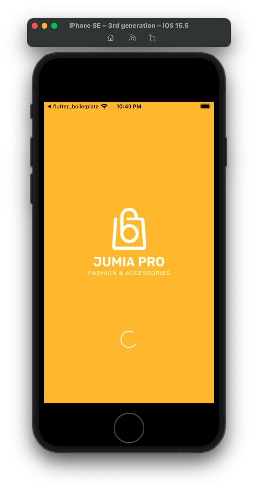
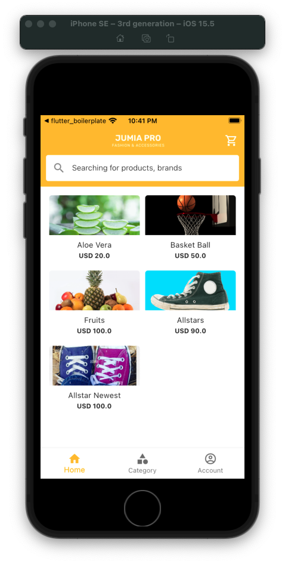
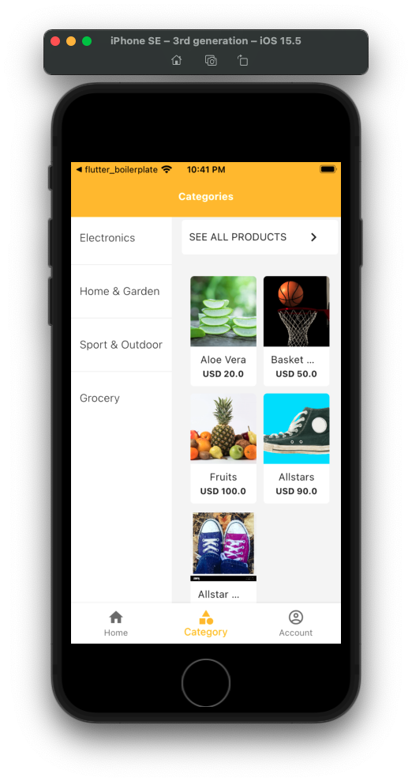
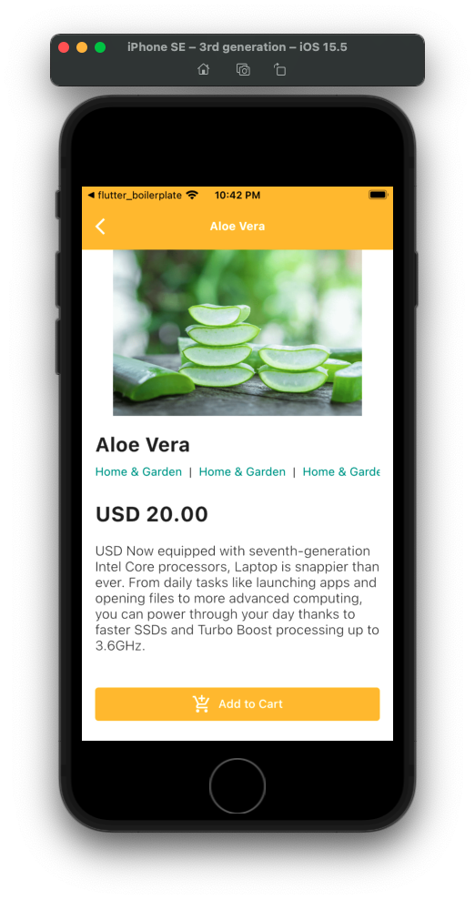

# E-Commerce App Clone

Source code to my [E-Commerce App Clone Series](https://www.youtube.com/watch?v=GjLESxSH-08&list=PLHQrb1WF9CVPyMda5CTuxih86PRnc4RVh) on YouTube

## About this project

Inspired by the [Jumia](https://play.google.com/store/apps/details?id=com.jumia.android) and
[Tonaton](https://play.google.com/store/apps/details?id=com.tonaton) Mobile Apps, I decided to build & film this.

## Screenshots

I took these on the Apple Simulator

| Splash                                      | Home                                        |
| ------------------------------------------- | ------------------------------------------- |
|  |  |

| Search                                      | Category                                    |
| ------------------------------------------- | ------------------------------------------- |
|  |  |

## Requirements

- Flutter 2.5.3
- Built on a Mac (Any Operating System should work tho 👍)
- A little knowledge of Dart and Flutter
- Subscription to my Channel: [The Cocky Comrade 🤪](https://youtube.com/thecockycomrade)

## Flutter

A few resources to get you started if this is your first Flutter project:

- [Lab: Write your first Flutter app](https://flutter.dev/docs/get-started/codelab)
- [Cookbook: Useful Flutter samples](https://flutter.dev/docs/cookbook)

For help getting started with Flutter, view our
[online documentation](https://flutter.dev/docs), which offers tutorials,
samples, guidance on mobile development, and a full API reference.
